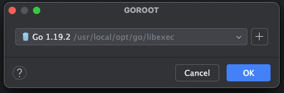

1.版本安装
mac 安装比较简单.如下命令直接安装最新版本
```shell
brew install go
```
安装指定版本
```shell
brew install go@1.22
```
如果要更新到最新版本
```shell
brew upgrade go
```

之前安装了了 1.19.2
```shell
go version
```


2.开发环境切换
```shell
brew unlink go
brew link go@1.19
```

3.hello go
3.1 开发
```go
package main

import "fmt"

func main() {
	fmt.Print("hello go")
}

```

3.2 编译

```shell
go build hellogo.go
```
编译成功后直接在当前代码所在根目录生成 hellogo 文件

3.3 编译+运行

```shell
go run hellogo.go
```

3.3 安装
直接安装后可以在mac 的 bin 目录下直接生成执行程序,这样当前的环境所有目录就可以直接运行了.
```shell
go install hellogo.go
```
