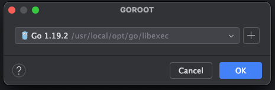

前言

>行文主要是在 https://go.dev/doc/tutorial/getting-started 官网的一些手册实操过程以及结合 java 现有的内容做的一些总结.

# 一.go 版本选择

行文到此时go 的版本已经到 1.22 .保持每年两个版本的更新节奏.

go release version记录:https://go.dev/doc/devel/release

>Go 1.0（2012年）
    初始稳定版本：确立了Go语言的基本语法、标准库和工具链.
    并发模型：正式推出了goroutine和channel,成为Go语言处理并发的核心特性.
>
> Go 1.1（2013年）
    性能提升：垃圾回收器（GC）的性能得到显著改善,程序启动时间减少.
    标准库增强：增加了对TLS/SSL的支持,以及更多网络和加密相关的包.
> 
> Go 1.3（2014年）
    更好的并发支持：对goroutine调度器进行了优化,提高了并发程序的性能.
    工具链改进：go test命令性能增强,支持并行测试.
> 
> Go 1.5（2015年）
    自举编译器：Go开始使用自己编写的Go编译器（以前是基于C的编译器）编译自身,这标志着Go工具链的一个重要里程碑.
    内存管理：引入了新的垃圾回收器,减少了GC暂停时间.
> Go 1.9（2017年）
    模块系统预览：开始实验模块系统（module system）,为后来的Go模块打下基础.
    性能和工具链优化：进一步提升了编译速度和链接器性能.
> 
> Go 1.11（2018年）
    Go Modules正式发布：引入了正式的Go模块支持,用于管理依赖,替代了传统的GOPATH模式.
    WebAssembly支持：使得Go代码可以直接编译为WebAssembly,在Web浏览器中运行.
> 
>Go 1.13（2019年）
    Error Wrapping：标准库中引入了新的错误处理模式,鼓励使用errors.Wrap来提供上下文丰富的错误信息.
    改进的内存分配：垃圾回收器的又一次重大改进,减少内存碎片,提升分配效率.
> 
>Go 1.14（2020年)
    更快的编译时间：继续优化编译器和链接器,进一步缩短了编译时间.
    软栈限制：增加了对goroutine堆栈自动增长的支持,改善了栈溢出的处理.
Go 1.16（2021年）
    嵌入文件支持：允许将文本或二进制文件作为资源嵌入到可执行文件中.
    默认启用模块：Go modules成为默认的依赖管理方式,不再需要设置环境变量.
Go 1.18（2022年）
    泛型支持：引入了泛型,这是一个里程碑式的更新,允许编写更加通用的代码.
    性能与工具链优化：持续的性能改进和工具链的更新,如更好的错误信息和调试支持.
Go 1.19及以后
    虽然具体细节随版本更新而变化,但Go团队持续关注于性能优化、标准库的增强、工具链的改进以及对最新硬件和操作系统的支持.每个版本都会带来一系列的bug修复、性能提升和小的功能增强,确保Go语言的持续进化.
    
从版本更新功能上看,在 1.18 版本更新了泛型功能.从语言角度来说是一次比较大的更新.从这个角度我们尽可能的去选择最新的版本.我这里选择的是 1.19 版本.

版本兼容性
> Go语言的设计哲学之一是强调版本间的兼容性,特别是Go 1发布之后,官方引入了Go 1兼容性承诺,保证了Go 1之后的所有版本
> （如Go 1.1, Go 1.2, ... Go 1.x）在语言规范、库接口以及编译器行为上向后兼容.这意味着,理论上,任何遵循Go 1规范编写的代码应该能在任何Go 1.x版本上无修改地编译和运行.这一点对于维护大型代码库和依赖众多第三方库的项目尤为重要.
尽管如此,在Go的发展过程中,还是存在一些需要注意的兼容性细节,尤其是在大版本更新时：
- 标准库变更：虽然核心语言特性和库接口承诺保持稳定,但在某些情况下,标准库中的函数、方法或类型可能会被弃用,或者新增功能.开发者在升级Go版本时,应检查是否有使用到已被弃用的API,并按照官方建议进行替换.
- 工具链变化：Go的工具链（如go fmt, go vet, go test等）和链接器在新版本中可能会有所改进或增加新功能,虽然这些改动通常不会影响已有代码的构建,但有时可能需要调整构建流程或工具配置.
- 平台和操作系统支持：随着时间推移,Go可能会停止对某些旧的操作系统或架构的支持,这要求在这些平台上运行Go应用时可能需要维持使用特定版本的Go.
- Cgo和其他外部依赖：如果项目依赖于Cgo或其他外部库,升级Go版本时需要确保这些依赖也兼容新版本的Go环境.
- 性能差异：虽然不是直接的兼容性问题,但不同版本的Go在编译器优化和垃圾回收算法等方面的改进,可能导致相同代码在不同版本上的运行性能有所不同.
为了确保升级过程中的兼容性,推荐采取以下措施：
- 在升级Go版本前,仔细阅读该版本的发布说明,了解所有的更改点.
- 使用go mod管理依赖,确保依赖项也与新版本Go兼容.
- 在隔离环境中测试升级后的代码,可以是通过虚拟机、Docker容器或其他隔离机制,确保所有测试通过后再全面迁移.
- 监控生产环境中的性能指标,确认升级后没有引入意外的性能下降.
- 
# 二.go 的环境准备
以 mac 环境为例.
mac 安装比较简单.如下命令直接安装最新版本
```shell
brew install go
```
安装指定版本
```shell
brew install go@1.22
```
如果要更新到最新版本
```shell
brew upgrade go
```

之前安装了了 1.19.2
```shell
go version
```


```shell
brew unlink go
brew link go@1.19
```


# 三.第一个 hello go

## 3.1 开发

```go
package main

import "fmt"

func main() {
	fmt.Print("hello go")
}

```

## 3.2 编译

```shell
go build hellogo.go
```

编译成功后直接在当前代码所在根目录生成 hellogo 文件

## 3.3 编译+运行

```shell
go run hellogo.go
```

## 3.4 直接安装

直接安装后可以在mac 的 bin 目录下直接生成执行程序,这样当前的环境所有目录就可以直接运行了.

```shell
go install hellogo.go
```
**Go**语言中,源代码文件经过编译后会生成可执行文件.可执行文件的文件类型与操作系统相关.


在**Windows**操作系统上,可执行文件的文件类型是.exe.

在**Linux**和**Unix**操作系统上,可执行文件的文件类型是无后缀的二进制文件.


例如,如果你在**Windows**上编译一个名为**hello.go**的Go源代码文件,你将得到一个名为hello.exe的可执行文件.在Linux上编译同样的源代码文件,你将得到一个名为hello的可执行文件.


需要注意的是,**Go**语言也支持交叉编译,即在一种操作系统上编译生成另一种操作系统的可执行文件.例如,在Windows上可以编译生成Linux环境下可执行文件,反之亦然.所以在交叉编译的情况下,生成的可执行文件的文件类型也与目标操作系统相关.
# 四.用 go 快速搭建 webserver

作为一个从 java 过来的人.现在利用 **springboot** **java** 里面搭建一个 **web** 应用程序已经非常方便了.不需要单独去下载 **web** 容器 汤姆凯特. 也不用到处去配置 **web.xml**.
仅仅用 @**SpringBootApplication** 注解+**maven** **tomcat** 插件自动就能启动 **web** 应用服务了.但是如下的几行 **go** 的代码就能搭建一个完整的 **web** 容器服务还是令我惊叹.
这也太简单了.这里一切要归功 **net/http** 的三方包的能力.

```go
package main

import (
	"fmt"
	_ "fmt"
	"net/http"
	_ "net/http"
)

func main() {
	http.HandleFunc("/", func(writer http.ResponseWriter, request *http.Request) {
		fmt.Fprint(writer, "web hello go")
	})
	err := http.ListenAndServe(":8880", nil)
	if err != nil {
		return
	}

}

```

访问
```html
http://127.0.0.1:8880/
```


# 五.调用外部三方方法
- code
```go
package main

import "fmt"
import "rsc.io/quote"

func main() {
	fmt.Println("hello go start")
	fmt.Println(quote.Hello())
	fmt.Println(quote.Go())
	fmt.Println("hello go end")
}

```
- 遇到的问题
  - cannot find package "rsc.io/quote"
  需要 init module.
```go
go mod init hello
```
download rsc.io/qutoe 包.
```go
go mod tidy
```
>Don't communicate by sharing memory, share memory by communicating.
>
不要共享内存来通信,而是通过通信来进行共享内存.
检索了一下发现这个大概是 go 语言大佬的至理名言.难不成我刚刚学习就被上课了?

这段代码主要是演示了 go 在执行外部三方过程的一些问题和执行.后续还有 go module 相关的内容.

# 四.go vs java 的执行

我们已经知道了 **java** 是解释执行的语言.他的 **slogan** 是一次编写到处运行(**write once ,run anywhere**).具体是通过 **jvm** (**java virtual machine**)来扮演的中间解释执行的角色.
相比之下在传统的编程语言中,比如**C、C++**,当程序被编译时,它们会被转换成特定底层硬件能够理解的代码.因此,如果我们尝试在另一台使用不同硬件的机器上运行相同的代码,
这台机器所理解的代码就会导致错误,所以你必须重新编译代码,使其能够被新硬件所理解.在这个背景下诞生了 java 的解释执行的方式,随之而来的则是被反复提及的解释执行的效率问题.
相比 go 


**Go**语言的编译过程可以分为三个主要步骤：词法分析、语法分析和代码生成.

词法分析（**Lexical Analysis**）：编译器首先会将源代码文件转换为一系列的词法单元（**tokens**）.词法单元是源代码中具有独立意义的最小单位,如关键字、标识符、运算符、常量等.词法分析器会根据事先定义好的词法规则,将源代码文件分割成一个个的词法单元.

语法分析（**Syntax Analysis**）：词法分析器生成的词法单元序列会被传递给语法分析器,它会根据语法规则构建一个抽象语法树（**Abstract Syntax Tree,AST**）.抽象语法树是一种以树状结构表示源代码结构的数据结构.语法分析器会根据语法规则验证源代码的语法正确性,并生成抽象语法树.

代码生成：一旦抽象语法树构建完成,编译器会根据抽象语法树生成目标代码.目标代码可以是机器码,也可以是字节码或中间代码,这取决于具体的编译器实现和编译目标.在**Go**语言中,编译器会将抽象语法树转换为平台相关的机器码,并将其保存到目标文件中.

最终,编译器会将所有源代码文件编译为目标文件,然后将目标文件链接成可执行文件或库文件.编译过程中还会进行一些优化措施,如常量折叠、无用代码消除等,以提高生成的代码的性能和效率.


# 五.总结
